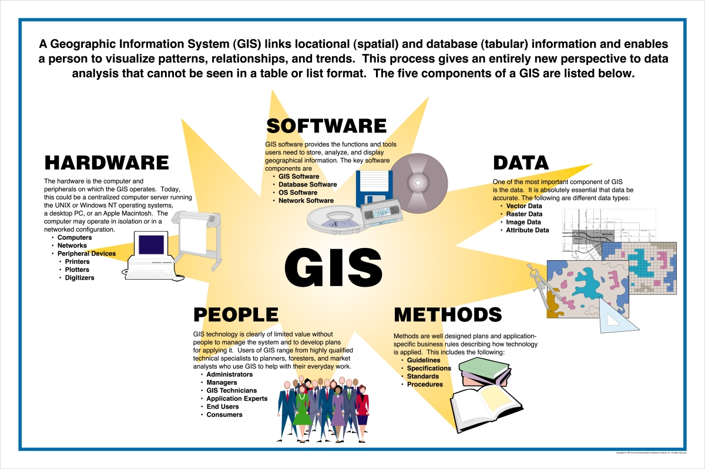
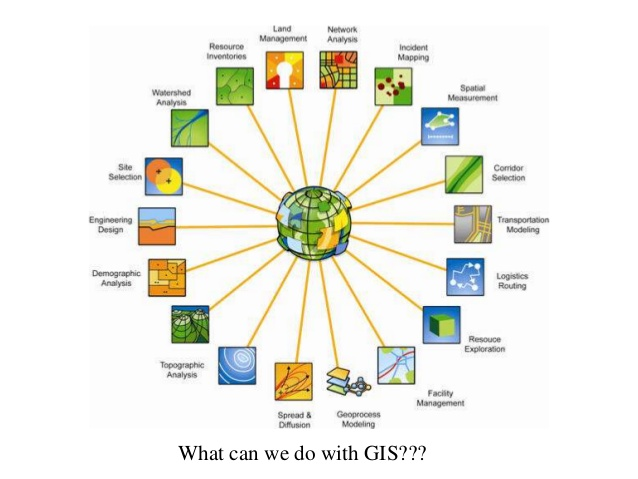

@title[gis resources @ uofl]
### GIS/Geospatial Technology 
### Resources
#### @ UofL
@fa[globe-americas]
###### D.J. Biddle, GISP
###### Use the @fa[angle-down] and @fa[angle-right] arrows to navigate
---
@title[about me]
### About me...
+++
@title[about me]
@ul
- GIS Technology Specialist
- University of Louisville Center for GIS
- 15 Years in GIS/Mapping
- Teach GIS courses (Including Web Mapping)
- Support research (faculty and student)
- Technical Support to campus GIS users
@ulend
---
@title[the plan]
### the plan
- What is GIS?
- GIS in support of env. policy research & practice
- Story Maps/Examples
- GIS Resources @ UofL
---
### what is gis? 
> @size[.6em](A geographic information system <GIS> is a framework for gathering, managing, and analyzing data. Rooted in the science of geography, GIS integrates many types of data. It analyzes spatial location and organizes layers of information into visualizations using maps and 3D scenes. ​With this unique capability, GIS reveals deeper insights into data, such as patterns, relationships, and situations—helping users make smarter decisions.) 
###### -Environmental Research Systems Institute (ESRI)
+++
@title[gis components]

+++
@title[gis database concept]

+++
@title[gis applications]

---

---
@title[helpful links]
- http://www.ulcgis.org
- https://www.esri.com
- https://www.esri.com/training
- https://www.arcgis.com
- https://storymaps.arcgis.com
- https://storymap.knightlab.com/ (Open Source Story Mapping)
- https://qgis.org/ (Open Source Desktop GIS)
+++
@title[questions?]
### Any questions? 
Please email me at <djbidd01@louisville.edu>

	

 