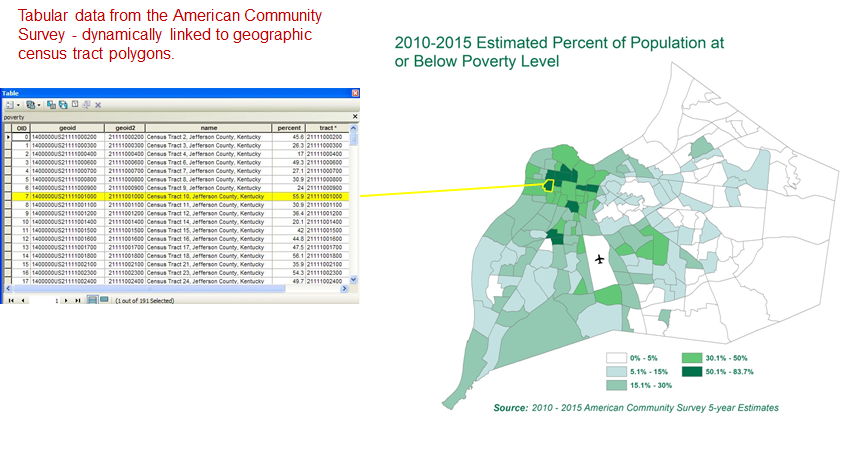
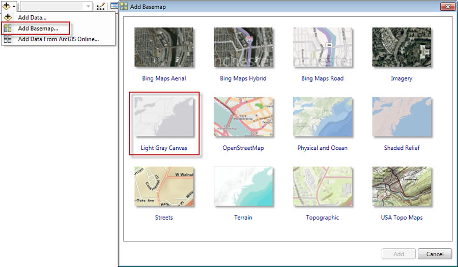
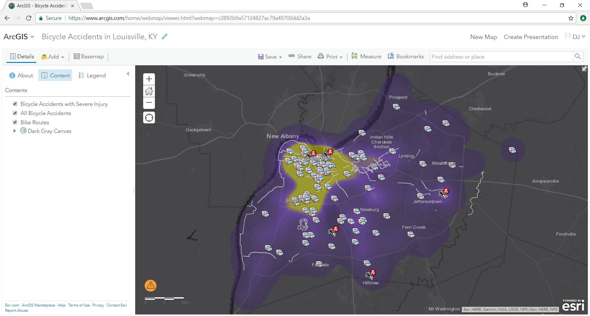
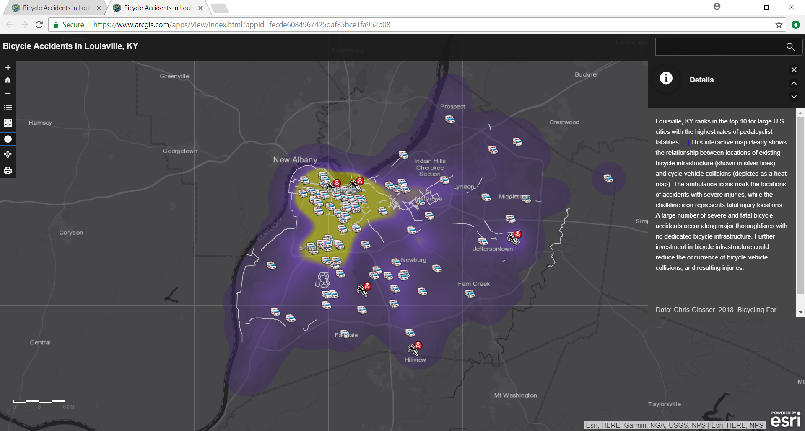
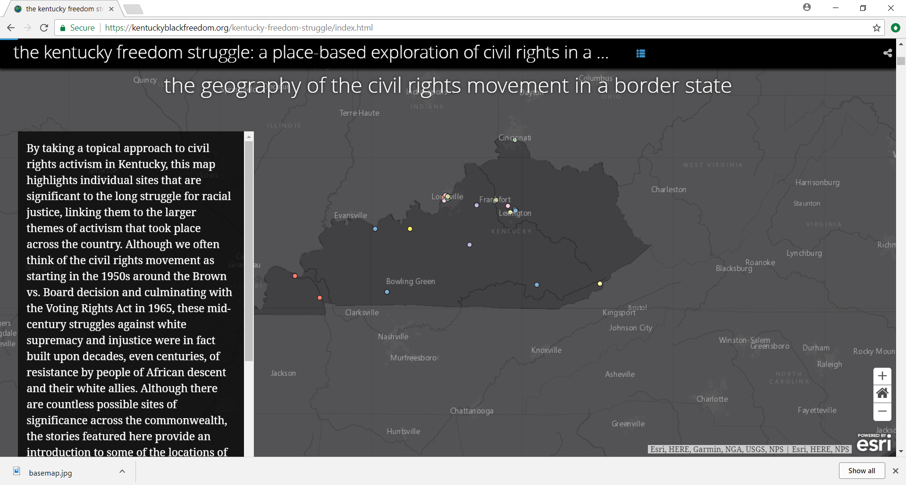

@title[Story Maps 101]
### Story Maps 
### 101
#### Trinity University FLC 
##### November 27th, 2018
@fa[fa-globe]
###### D.J. Biddle, GISP
###### Use the @fa[angle-down] and @fa[angle-right] arrows to navigate
---
@title[About Me]
### About me...

@ul
- GIS Technology Specialist
- University of Louisville Center for GIS
- 15 Years in GIS/Mapping
- Teach GIS courses (Including Web Mapping)
- Support research (faculty and student)
- Technical Support to campus GIS users
@ulend
---
@title[The Plan]
### The Plan
- Demo: The Five Minute Story Map!
- What are Story Maps? 
- Why use Story Maps? 
- Activity: Check out the Story Maps Gallery 
- How do we build Story Maps? 
- Some examples
- More resources
- Live Exercise: A Story Map of Thrones
---
@title[The Five Minute Story Map]
### The Plan
- **Demo: The Five Minute Story Map!**
- What are Story Maps? 
- Why use Story Maps? 
- Activity: Check out the Story Maps Gallery 
- How do we build Story Maps? 
- Some examples
- More resources
- Live Exercise: A Story Map of Thrones
+++
@title[The Five Minute Story Map]
### The Five Minute Story Map
Creating Story Maps is EASY! I can make one in literally five minutes! 

Here's how you can too!

##### [The Five Minute Story Map](https://docs.google.com/document/d/17qBNC64tqLMRPlIPAIV4bPz1utKzhUq6mv6vEbwQeYc/edit?usp=sharing)
--- 
@title[What are Story Maps]
### The Plan
- ~~Demo: The Five Minute Story Map!~~
- **What are Story Maps?** 
- Why use Story Maps?
- Activity: Check out the Story Maps Gallery 
- How Do we build Story Maps? 
- Some examples
- More resources
- Live Exercise: A Story Map of Thrones
+++
### What are Story Maps? 
> @size[.6em] Story Maps are **lightweight web applications** that mash up interactive GIS **maps**, photos/videos and other **multimedia content**, and text-based **narratives**, to tell a story about places or phenomenon that are explicitly located in space and time. 
+++
### What are Story Maps?
> @size[.6em] Story Maps leverage modern web development tools to provide an  **engaging, dynamic user experience** that grounds your story in its **geographic setting**.
@ul
- Everything happens...
- Somewhere!
@ulend
+++
### What are Story Maps? 
> @size[.6em] Story Maps are hosted applications that live in the cloud through common storymapping platforms like [ESRI Story Maps](https://storymaps.esri.com), or [KnghtLabs StoryMapJS](https://storymap.knightlab.com/) 
+++
### What are Story Maps? 
> @size[.6em] Story Maps are **free** and **open source**. Users can download and customize them right from the source code. Most Story Map template source code is hosted on [Github](https://www.google.com/search?q=esri+story+maps+github). 
---
@title[Why use Story Maps?]
### The Plan
- ~~Demo: The Five Minute Story Map!~~
- ~~What are Story Maps?~~ 
- **Why use Story Maps?** 
- Activity: Check out the Story Maps Gallery 
- How do we build Story Maps? 
- Some examples
- More resources
- Live Exercise: A Story Map of Thrones
+++
### Why use Story Maps? 
> @size[.6em] Story Maps are an easy and effective way to share research results, fieldwork experiences, student project presentations, or engaged scholarship efforts. 
+++
### Why use Story Maps? 
> @size[.6em] Story Maps communicate information in an entertaining and engaging way that traditional presentations (posters, web pages, white papers, etc) often lack. 
+++
### Why use Story Maps? 
> @size[.6em] ESRI's Story Maps platform features **responsive** templates that display correctly in all modern web-browsers, including mobile device browsers. They are O/S and browser **agnostic**. 
+++
### Why use Story Maps? 
> @size[.6em] In the classroom, Story Maps make wonderful **group projects**, that help students develop some basic technical skills in **web-based GIS** and **WYSIWYG web development**. 
+++
### Why use Story Maps? 
> @size[.6em] Story Maps encourage **critical thinking** and effective communication of data. 
---
@title[Activity: Check out the Story Maps Gallery]
### The Plan
- ~~Demo: The Five Minute Story Map!~~
- ~~What are Story Maps?~~ 
- ~~Why should we use them?~~ 
- **Activity: Check out the Story Maps Gallery** 
- How do we build Story Maps? 
- Some examples
- More resources
- Live Exercise: A Story Map of Thrones
+++
### Activity: Check out the Story Maps Gallery
- **Time**: 5 minutes
- **Task**: Go to [ESRI's Story Maps Gallery](http://storymaps.arcgis.com/en/gallery/) and browse the public Story Maps
- **Objective**: Find one story map that you find compelling
+++
### Activity: Check out the Story Maps Gallery
Take note of...
- **Why** you find it effective (the topic? organization?, multimedia content?)
- **Which** template was used? Tour? Journal? Cascade?
- **How** you might employ a similar map in your own teaching and/or research
---
@title[Activity: How do we build Story Maps]
### The Plan
- ~~Demo: The Five Minute Story Map!~~
- ~~What are Story Maps?~~ 
- ~~Why should we use them?~~ 
- ~~Activity: Check out the Story Maps Gallery~~ 
- **How do we build Story Maps?** 
- Some examples
- More resources
- Live Exercise: A Story Map of Thrones
+++
### How do we build Story Maps?
Two main Story Map platforms...
- [KnightLab StoryMapJS](https://storymap.knightlab.com/)
    - Simple, interactive editing of locations and text
    - Basic interface with limited customizations
- [ESRI Story Maps](https://storymaps.arcgis.com)
    - Runs on ArcGIS Online web GIS 
    - Sophisticated data management tools
    - Template options for custom look and feel
+++
### How do we build Story Maps?
##### ArcGIS Online
- Cloud-based GIS environment by ESRI
- Store/edit/display/analyze geographic data
- Build **web maps** and **web apps** to **share** with users in an organizations or publicly.
+++
### How do we build Story Maps?
##### ArcGIS Online Key Terms
**Feature Layer**: Set of geographic features sharing the same geometry and attributes, hosted in ArcGIS Online. 

+++
### How do we build Story Maps?
##### ArcGIS Online Key Terms
**Basemap**: A tiled/slippy map that serves as the background for your Feature Layers

+++
### How do we build Story Maps?
##### ArcGIS Online Key Terms
**Web Map**: A map in AGOL that consumes Feature Layers and basemaps. Full featured environment for data editing, analysis, and visualization.

+++
### How do we build Story Maps?
##### ArcGIS Online Key Terms
**Web App**: A front-end “wrapper” that consumes a web map and provides custom functionality to the end user.
 
+++
### How do we build Story Maps?
##### ArcGIS Online Key Terms
**Story Map**: A web app template that builds narratives around
a set of spatial data. 

+++
### How do we build Story Maps?
##### Three ways...
- Story Map Builder (Five Minute Story Map)
- Build web map & share as web app (Story Map of Thrones)
- Download and configure (for advanced users)
+++
### How do we build Story Maps?
##### Guiding Principles
**Know your audience**
- Don't assume they know your intent or how things work. **Explain it**. 
- Keep the language low level. Avoid techno-babble.
- Remember: You won't be there to hold their hand!
+++
### How do we build Story Maps?
##### Guiding Principles
**Start with a bang!**
- First impressions count, so lead off with an engaging video, image, title, etc.
- Keep them engaged
- You are competing for their attention with the ENTIRE Internet!
+++
### How do we build Story Maps?
##### Guiding Principles
**Visual simplicity rules the day**
- Keep visual clutter to a minimum
- Let the data speak!
- Choose a basemap that emphasizes your data rather than overshadows it.
+++
### How do we build Story Maps?
##### Guiding Principles
**Choose your template wisely**
- What is the purpose of your Story Map?
    - Sequential story?
    - Comparing two datasets?
    - List of locations?
- It is difficult to change templates mid-project
- Measure twice, cut once! 
+++
###### ["Principles of Cartographic Design"](http://www.neercartography.com/principles-of-cartographic-design/)
###### of the British Cartographic Society
1. Concept before compliation
2. Hierarchy with harmony
3. Simplicity from sacrifice
4. Maximum information at minimum costs
5. Engage the emotion to engage the understanding  
---
@title[Example Story Maps]
### The Plan
- ~~Demo: The Five Minute Story Map!~~
- ~~What are Story Maps?~~ 
- ~~Why should we use them?~~ 
- ~~Activity: Check out the Story Maps Gallery~~ 
- ~~How do we build Story Maps?~~ 
- **Some examples**
- More resources
- Live Exercise: A Story Map of Thrones
+++
### Some Examples
##### Story Map Tour
<iframe class = "stretch" data-src="https://esrimedia.maps.arcgis.com/apps/MapTour/index.html?appid=044d0dd78fb043c6918eaa495fae50c6"></iframe>
+++
### Some Examples
##### Story Map Series
<iframe class = "stretch" data-src = "https://centerforgis.maps.arcgis.com/apps/MapSeries/index.html?appid=6075857164044d528bda12115bd1ab25"></iframe>
+++
### Some Examples
##### Story Map Series
<iframe class = "stretch" data-src = "https://centerforgis.maps.arcgis.com/apps/MapSeries/index.html?appid=e7fd5854dbab435b944c27913df01980"></iframe>
+++
### Some Examples
##### Story Map Journal
<iframe class = "stretch" data-src = "https://centerforgis.maps.arcgis.com/apps/MapJournal/index.html?appid=7c3e27c2078f4e17a30b6b8b141998bc"></iframe>
+++
### Some Examples
##### Swipe Compare Story Map
<iframe class = "stretch" data-src = "https://centerforgis.maps.arcgis.com/apps/StorytellingSwipe/index.html?appid=8643552a3ca24585b4084a4fb20f5acf"></iframe>
+++
### Some Examples
##### Story Map Cascade
<iframe class = "stretch" data-src = "https://centerforgis.maps.arcgis.com/apps/Cascade/index.html?appid=08c2849d3f1649758e40b8cfa67d0248"></iframe>
+++
### Some Examples
##### Story Map Cascade
<iframe class = "stretch" data-src = "https://kentuckyblackfreedom.org/kentucky-freedom-struggle/index.html"></iframe>
+++
### Some Examples
##### Story Map Cascade
<iframe class = "stretch" data-src = "https://storymaps.esri.com/stories/2018/anthropocene/2-the-land.html"></iframe>
---
@title[More Resources]
### The Plan
- ~~Demo: The Five Minute Story Map!~~
- ~~What are Story Maps?~~ 
- ~~Why should we use them?~~ 
- ~~Activity: Check out the Story Maps Gallery~~ 
- ~~How do we build Story Maps?~~ 
- ~~Some examples~~
- **More resources**
- Live Exercise: A Story Map of Thrones
+++
@title[More Resources]
### More Resources
- https://www.esri.com/arcgis-blog/story-maps/
- https://adventuresinmapping.com/
- https://www.esri.com/training/
- https://www.esri.com/about/newsroom/arcuser/make-your-story-map-successful/ 
- https://www.esri.com/arcgis-blog/products/arcgis-online/uncategorized/twelve-days-of-story-map-tips/
---
@title[Example Story Maps]
### The Plan
- ~~Demo: The Five Minute Story Map!~~
- ~~What are Story Maps?~~ 
- ~~Why should we use them?~~ 
- ~~Activity: Check out the Story Maps Gallery~~ 
- ~~How do we build Story Maps?~~ 
- ~~Some examples~~
- ~~More resources~~
- **Live Exercise: A Story Map of Thrones**
+++
### Live Exercise: A Story Map of Thrones
- **Time**: ~45 minutes
- **Task**: Guided exercise to build a Cascade Story Map
- **Objective**: Learn to upload data, create a web map, and create a Cascade Story Map.

[A Story Map of Thrones!](https://docs.google.com/document/d/1GKNUkv7X6YJ0B-2siHUD2ZypOz47hA9IP3LfYg0GRvk/edit?usp=sharing)
--- 
@title[questions?]
### Any questions? 
Please email me at <djbidd01@louisville.edu>

	

 